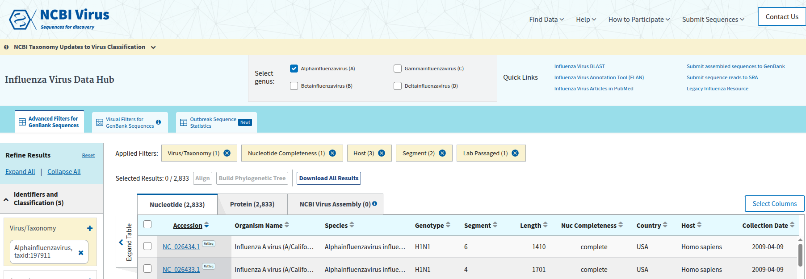
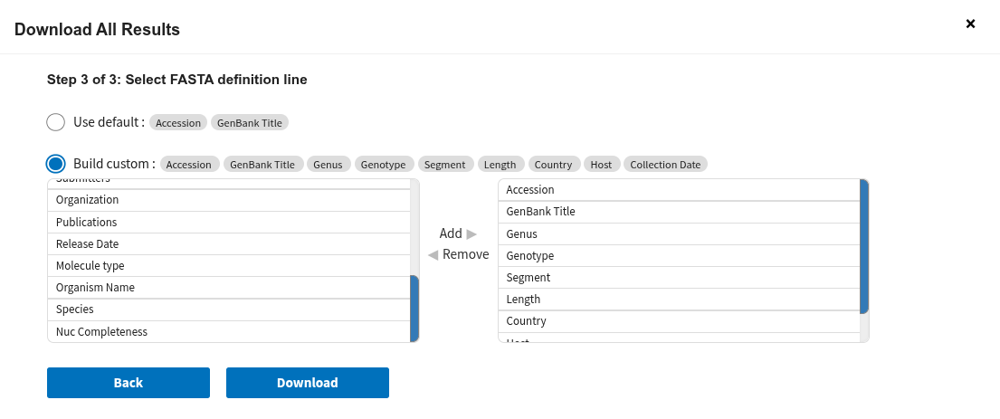

# Block 1: Introduction and first steps
## Project 1: Phylogenetics of Influenzavirus

## Introduction to the Linux commandline
The Linux command line is a text interface to your computer. Often referred to as the shell, terminal, console, prompt or various other names, it can give the appearance of being complex and confusing to use. But after getting used to the black screen and the keyboard-centric interface, you will quickly understand why its so powerful!

For this course, we need some very fundamental commands. Namely:
| Command | Description |
|----------|--------------|
| `ls` | Lists files and directories in the current directory. |
| `mkdir` | Creates a new directory. |
| `rm` | Removes files or directories (use `-r` for recursive deletion). |
| `rmdir` | Removes an empty directory. |
| `cd` | Changes the current working directory. |
| `cp` | Copy files from A to B. |
| `mv` | Move files from A to B. |
| `pwd` | Prints the current working directory path. |
| `grep` | Searches for a pattern or string in files or input. |
| `uniq` | Filters out or reports repeated lines in sorted input. |
| `sed` | Stream editor for filtering and transforming text. |
| `head` | Displays the first few lines of a file (default: 10). |
| `tail` | Displays the last few lines of a file |
| `tree` | Displays directories and files in a tree-like structure. |
| `cat` | Concatenates and displays file contents. |
| `less` | Displays the content of a file (easy scrolling). |
| `ssh` | Connects securely to a remote machine via the command line. |
| `scp` | Securely copies files between local and remote machines over SSH. |

The terminal is slightly different than other programs e.g. when it comes to copying and pasting content from the clipboard. Here are a few shortcuts:

| Shortcut | Description |
|-----------|--------------|
| `Ctrl + Shift + C` | Copy selected text (in most Linux terminals). |
| `Ctrl + Shift + V` | Paste copied text. |
| `Ctrl + L` | Clears the terminal screen. |
| `Ctrl + R` | Searches command history interactively. |
| `Tab` | Auto-completes file or directory names (<- this one is your friend!) |
| `↑ / ↓` | Scrolls through previous and next commands in history. |
| `Ctrl + D` | Closes the terminal or logs out of the current shell. |
</br>

---
## Implement the project structure
In our course directory (`/lisc/scratch/course/2025w301520/`), create the folder `<USER>` (replace `<USER>` with your username) and go into it.

<details>

<summary>See commands</summary>

```bash
cd /lisc/scratch/course/2025w301520/;
mkdir <USER>;
cd  <USER>;
```

</details>


Once in that directory, we will create the directory structure, so we can work in a nice environment 😉.
```bash
<USER>
└── fluA
    ├── data            # store original downlaoded 'raw' data
    ├── processed_HA_NA # store processed input sequence and metadata files
    ├── scripts         # store all scripts
    ├── tmp             # store all intermediate files (those which do not get used by downstream software)
    └── tree            # store tree-related files
```

<details>

<summary>See commands</summary>

```bash
# Make <USER>/fluA directory and change to it
mkdir fluA;
cd fluA;

# Make directories inside of ~/2025w301520/fluA
mkdir data;
mkdir processed_HA_NA;
mkdir scripts;
mkdir tmp;
mkdir tree;

# Visualise your directory structure
tree .;
```

</details>
</br>

---
## Populate your script directory
Copy all scripts (`*`) from `/lisc/data/scratch/course/2025w301520/fluA/scripts` to your own script directory (`<USER>/fluA/scripts`)

```bash
cp /lisc/data/scratch/course/2025w301520/fluA/scripts/* scripts/;
```

Lets check it all looks fine.
```bash
tree .;
```

<details>

<summary>You should see the following</summary>


</details>
</br>

---
## Download the correct Influenzavirus segments
Let's first go to the influenza resource of NCBI ([https://www.ncbi.nlm.nih.gov/labs/virus/vssi/#/](https://www.ncbi.nlm.nih.gov/labs/virus/vssi/#/)).

These are the filtering criteria we will use to download the correct sequences:
- Genus: Alphainfluenzavirus A
- Nucleotide completeness: complete
- Host (3): avian, swine, human
- exclude lab strains
- Segment (2): HA & NA

<details> 
<summary>After choosing these filters, it should look like this:</summary>


    
</details>
    
When it looks correct, click on "Download All Results". In order for each sequence to include relevant metadata (which we will use to annotate our tree at the end), we need to export specific fields:
- Step 1: Choose Sequence Data (FASTA format): Nucleotide
- Step 3: Check "Build custom" for your FASTA definition header line and choose in this given order (by clicking on "Add"):
    - Accession
    - GenBank Title
    - Genus
    - Genotype
    - Segment
    - Length
    - Country
    - Host
    - Collection Date
 
<details>
<summary>After you see each field in the right list, as shown below, click on download.</summary>
    


</details>

</br>

---
## Copy the file onto your `<USER>/fluA/data` directory
```bash
scp sequences_IA_HA_NA.fasta <USER>@login01.lisc.univie.ac.at:/lisc/scratch/course/2025w301520/<USER>/fluA/data;
```

Now, we are ready to start... preparing the files!

</br>

<p align="right">
    <kbd> <br> <a href="./Block_2.md"><b><large>Next: Block 2</large></b></a> <br> </kbd>
</p>
