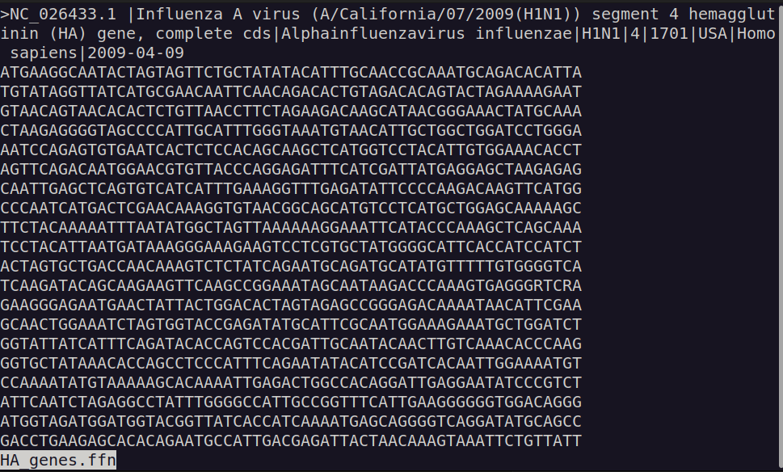
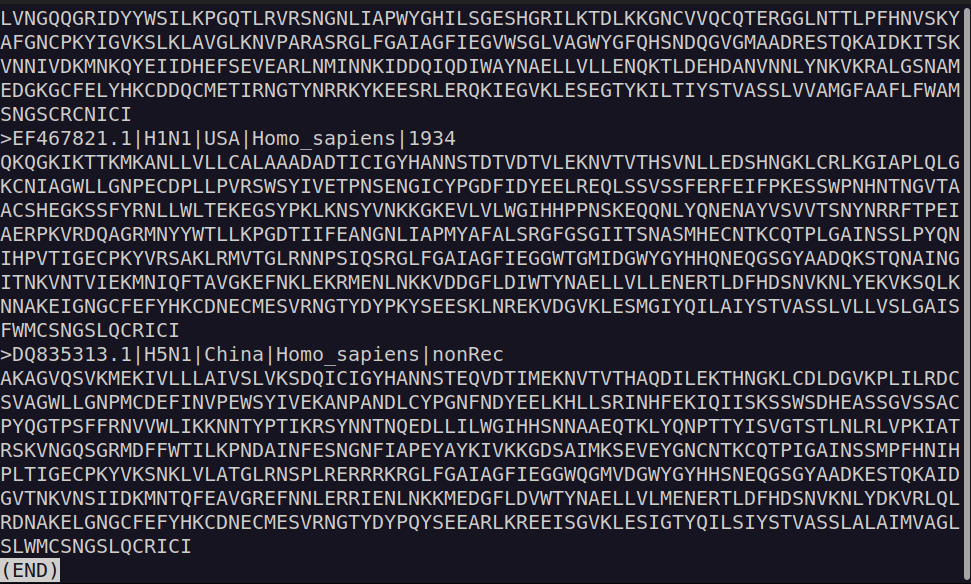
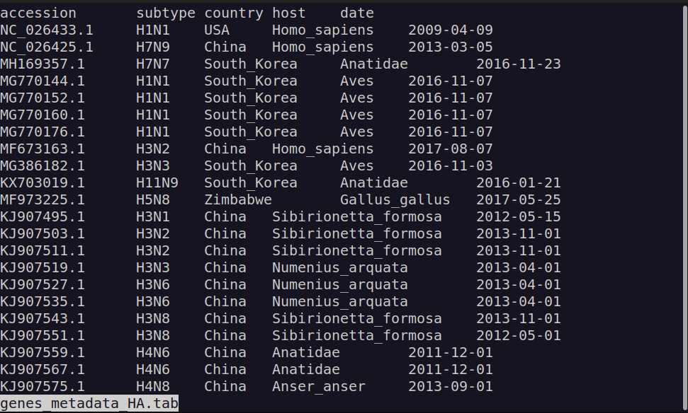

# Block 2: Processing of sequence dataset

## Make sure we are inside our working directory

```bash
pwd;
```
Output should show `/lisc/home/user/<USER>/2025w301520/fluA`. This is the directory we created at the end of our previous excercise block.

## Change to temporary directory

```bash
cd tmp;
```
Since most files we will generate are temporary, it makes more sense to work inside this directory and only write final processed files in  `/lisc/home/user/<USER>/2025w301520/fluA/processed_HA_NA`.

## Inspect data file

```bash
less ../data/sequences_IA_HA_NA.fasta;
```
- Click <kbd>↑</kbd> and <kbd>↓</kbd> to navigate through the file visualisation.

- Click <kbd>Q</kbd> to exit the viewing.

<details>

<summary>See output</summary>


</details>
<br/>


### Count sequences
```bash
grep -c ">" ../data/sequences_IA_HA_NA.fasta;
```
<br/>


### Look at headers: too long and too much information 🤮
```bash
grep ">" ../data/sequences_IA_HA_NA.fasta | less;
```
- Remember: `| less` is used to pass the output of `grep ">" ../data/sequences_IA_HA_NA.fasta`. This allows us to scroll using <kbd>↑</kbd> and <kbd>↓</kbd> through the ouput in a similar fashion as before.

<details>

<summary>See output</summary>


</details>
<br/>

---
## Get sequences only for those where both the Hemagglutinin (HA) and Neuraminidase (NA) gene sequences are available
```bash
grep "^>" ../data/sequences_IA_HA_NA.fasta | grep -v "KC95119[68]" | sed 's/.\+virus (//' | sed 's/)) [a-z]\+ .\+/)/' | uniq -c | grep -P "^\s+2" | sed 's/^\s\+2 //' > HA_NA_genes.lst;
```

- Command breakdown

```bash
grep "^>" ../data/sequences_IA_HA_NA.fasta \ # grab only the header (lines starting with ">").
| grep -v "KC95119[68]" \                    # remove accessions KC951196 and KC951198
| sed 's/.\+virus (//' \                    # remove all text preceding the virus name*.
| sed 's/)) [a-z]\+ .\+/)/' \               # remove all text following the virus name*.
| uniq -c \                                 # get a unique list of the identifiers and count the number of occurrences
| grep -P "^\s+2" \                         # select only those lines where exactly two sequences are found per unique identifier
| sed 's/^\s\+2 //' \                       # remove the count preceding the identifier
> HA_NA_genes.lst;                          # output result to file containing the list
```

<details>

<summary>* internationally accepted naming convention for influenza viruses</summary>


Source: Modified from http://www.ncbi.nlm.nih.gov/pmc/articles/PMC2395936/pdf/bullwho00427-0070.pdf

</details>

<details>

<summary>See output</summary>

```bash
grep "^>" ../data/sequences_IA_HA_NA.fasta | grep -v "KC95119[68]" | less;
```


```bash
grep "^>" ../data/sequences_IA_HA_NA.fasta | grep -v "KC95119[68]" | sed 's/.\+virus (//' | less;
```


```bash
grep "^>" ../data/sequences_IA_HA_NA.fasta | grep -v "KC95119[68]" | sed 's/.\+virus (//'  | sed 's/)) [a-z]\+ .\+/)/' | less;
```


```bash
grep "^>" ../data/sequences_IA_HA_NA.fasta | grep -v "KC95119[68]" | sed 's/.\+virus (//'  | sed 's/)) [a-z]\+ .\+/)/' | uniq -c | less;
```


```bash
grep "^>" ../data/sequences_IA_HA_NA.fasta | grep -v "KC95119[68]" | sed 's/.\+virus (//'  | sed 's/)) [a-z]\+ .\+/)/' | uniq -c | grep -P "^\s+2" | less;
```


```bash
grep "^>" ../data/sequences_IA_HA_NA.fasta | grep -v "KC95119[68]" | sed 's/.\+virus (//'  | sed 's/)) [a-z]\+ .\+/)/' | uniq -c | grep -P "^\s+2" | sed 's/^\s\+2 //' | less;
```


</details>
<br/>


### Let's count how many unique identifiers (i.e. unique viruses) occurr **only** twice
```bash
wc -l HA_NA_genes.lst;
```
<br/>


### Now, let's filter out those unique viruses for which either HA or NA genes are missing 
```bash
perl ../scripts/filter_and_separate.pl HA_NA_genes.lst ../data/sequences_IA_HA_NA.fasta;
```
See <a href="./scripts/filter_and_separate.pl" target="_blank">filter_and_separate.pl</a>

We get two files created
   - HA_genes.ffn
   - NA_genes.ffn

<details>

<summary>See output</summary>

```bash
less HA_genes.ffn;
```



</details>
<br/>

**Important:** From now one we are working on two file streams: the hemagglutinin ("HA") and the Neuraminidase ("NA").

<br/>

---
## Simplify and standardise headers
```bash
sed 's/>\(\S\+\) \S\+ .\+|\(H[0-9]\+N[0-9]\+\)|[^|]\+|[0-9]\+|\(\S\+\)/>\1|\2|\3/' HA_genes.ffn | sed 's/\s\+/_/g' > HA_genes_newHead.ffn;
sed 's/>\(\S\+\) \S\+ .\+|\(H[0-9]\+N[0-9]\+\)|[^|]\+|[0-9]\+|\(\S\+\)/>\1|\2|\3/' NA_genes.ffn | sed 's/\s\+/_/g' > NA_genes_newHead.ffn;
```

- Command breakdown

Given the following example header

`>NC_026433.1 |Influenza A virus (A/California/07/2009(H1N1)) segment 4 hemagglutinin (HA) gene, complete cds|Alphainfluenzavirus influenzae|H1N1|4|1701|USA|Homo sapiens|2009-04-09`

```regex
>\(\S\+\)
```
> Matches: `NC_026433.1`. The syntax `\(text\)` saves to `\1`, `\2`, `\3`, ...

```regex
 \S\+ .\+|
```
> Matches: ` |Influenza A virus (A/California/07/2009(H1N1)) segment 4 hemagglutinin (HA) gene, complete cds|Alphainfluenzavirus influenzae|`.

```regex
\(H[0-9]\+N[0-9]\+\)
```
> Matches: `H1N1`. Saves string to `\2`.

```regex
|[^|]\+|[0-9]\+|'
```
> Matches: `|4|1701|`

```regex
\(\S\+\)'
```
> Matches: `USA|Homo sapiens|2009-04-09`. Saves string to `\3`.

```regex
>\1|\2|\3/
```
> Substitute whole header string with `>NC_026433.1|H1N1|USA|Homo sapiens|2009-04-09`.
> - `\1`: "NC_026433.1".
> - `\2`: "H1N1".
> - `\3`: "USA|Homo_sapiens|2009-04-09".

```bash
sed 's/\s\+/_/g'
```
> Substitute all continuous white spaces (` `) with a single `_` character.
</br>

Now, lets see our brand new headers.
```bash
grep ">" HA_genes_newHead.ffn | less;
```

<details>

<summary>See output</summary>


</details>
<br/>

---
### Wait! Let's do some checks

While `|` separates the different fields from the header, what happens if data is missing from one field?

Lets check for missing (i.e. empty) fields

```bash
grep '||' HA_genes_newHead.ffn;
```

<details>

<summary>See output</summary>


</details>

In order to fix this, we will add to the previous commands a replacement for missing fields.
```bash
sed 's/||/|nonRec|/g'   # Substitute missing field within the string
sed 's/|$/|nonRec/'     # Substitute missing field at the end of the string
```
> This will substitute missing fields for a standardised string `nonRec`.

Generate FASTA files with correct simplified headers
```bash
sed 's/>\(\S\+\) \S\+ .\+|\(H[0-9]\+N[0-9]\+\)|[^|]\+|[0-9]\+|\(\S\+\)/>\1|\2|\3/' HA_genes.ffn | sed 's/\s\+/_/g' | sed 's/||/|nonRec|/g' | sed 's/|$/|nonRec/' > HA_genes_newHead.ffn;
sed 's/>\(\S\+\) \S\+ .\+|\(H[0-9]\+N[0-9]\+\)|[^|]\+|[0-9]\+|\(\S\+\)/>\1|\2|\3/' NA_genes.ffn | sed 's/\s\+/_/g' | sed 's/||/|nonRec|/g' | sed 's/|$/|nonRec/' > NA_genes_newHead.ffn;
```
<br/>

---
## Tranlsate nucleotide sequences to amino acids for alignment

Wait! lets first load **[seqkit](https://bioinf.shenwei.me/seqkit/)**!
```bash
module load conda;
conda activate seqkit-2.10.1;
```

Now, to the translation.
```bash
seqkit translate --allow-unknown-codon --frame 1 --transl-table 1 --seq-type dna --threads 2 HA_genes_newHead.ffn | less;
```

- Command breakdown

```bash
seqkit translate \      # use the "translate" tool from seqkit
--allow-unknown-codon \ # use X for unknown codons instead of *
--frame 1 \             # translate only frame 1
--transl-table 1 \      # use translation table 1
--seq-type dna \        # input sequence is DNA
--threads 2 \           # use two threads for processing
HA_genes_newHead.ffn;   # specify input file
```

<details>

<summary>See output</summary>

To view this example click the <Kbd>End</Kbd> key.


**WARNING!** Sequences are not all in the correct start frame.

</details>

### Identify correct starting frame and trim resulting files
Make a tabular file with percentage of asterisks in the third colum.
```bash
seqkit translate --allow-unknown-codon --frame 1,2,3 --transl-table 1 --seq-type dna --threads 2 HA_genes_newHead.ffn | seqkit fx2tab -B '*' > HA_genes_newHead_trans3.tab;
seqkit translate --allow-unknown-codon --frame 1,2,3 --transl-table 1 --seq-type dna --threads 2 NA_genes_newHead.ffn | seqkit fx2tab -B '*' > NA_genes_newHead_trans3.tab;
```

- Command breakdown

```bash
seqkit translate \      # use the "translate" tool from seqkit
--allow-unknown-codon \ # use X for unknown codons instead of *
--frame 1,2,3 \         # translate on all forward sense frames (1,2,3)
--transl-table 1 \      # use translation table 1
--seq-type dna \        # input sequence is DNA
--threads 2 \           # use two threads for processing
HA_genes_newHead.ffn \  # specify input file
| seqkit fx2tab \       # pass result to "fx2tab" seqkit tool
-B '*';                 # get percentage of chosen character ("*") per tranlsated sequence
```

<details>

<summary>See output</summary>

```bash
less HA_genes_newHead_trans3.tab;
```


</details>

### Get a tabular file with the corresponding predicted correct frame
```bash
perl ../scripts/predict_frame.pl HA_genes_newHead_trans3.tab > HA_genes_newHead_frame.tab;
perl ../scripts/predict_frame.pl NA_genes_newHead_trans3.tab > NA_genes_newHead_frame.tab;
```
See <a href="./scripts/predict_frame.pl" target="_blank">predict_frame.pl</a>


<details>

<summary>See output</summary>

```bash
less HA_genes_newHead_frame.tab;
```


</details>

### Make new ffn files with correct frame by trimming
```bash
perl ../scripts/trim_fasta_to_frame.pl tmp_HA_genes_newHead_frame.tab HA_genes_newHead.ffn | seqkit seq -w 0 > HA_genes_newHead_corrFrame.ffn;
perl ../scripts/trim_fasta_to_frame.pl tmp_NA_genes_newHead_frame.tab NA_genes_newHead.ffn | seqkit seq -w 0 > NA_genes_newHead_corrFrame.ffn;
```
See <a href="./scripts/trim_fasta_to_frame.pl" target="_blank">trim_fasta_to_frame.pl</a>

- Command breakdown

```bash
seqkit seq -w 0
```

The `seq` tool from `seqkit` is used for transforming sequences (extract ID, filter by length, remove gaps, reverse complement, etc). the -w is a global flag that defines the output line width. A value of '0' means that strings remain together and not split throughout different lines (a.k.a no wrap).This is used to transform a so-called "multi-line" FASTA into a "one-line" FASTA, where all the sequence is contiguous in one single line. This facilitates downstream operations on the sequence.

### Use seqkit to translate the files
```bash
seqkit translate --allow-unknown-codon --frame 1 --transl-table 1 --seq-type dna --threads 2 HA_genes_newHead_corrFrame.ffn > HA_genes_newHead_corrFrame.faa;
seqkit translate --allow-unknown-codon --frame 1 --transl-table 1 --seq-type dna --threads 2 NA_genes_newHead_corrFrame.ffn > NA_genes_newHead_corrFrame.faa;
```

<details>

<summary>See output</summary>

```bash
less HA_genes_newHead_corrFrame.faa;
```

To view this example click the <Kbd>End</Kbd> key.


**Warning!** Some genes still have additional residues after the stop codon!

</details>

### Use seqkit to translate the files and then trim the stop codons and subsequent aminoacids
```bash
seqkit translate --allow-unknown-codon --frame 1 --transl-table 1 --seq-type dna --threads 2 HA_genes_newHead_corrFrame.ffn | seqkit seq -w 0 | sed 's/\*\S\{0,30\}$//' | sed 's/\*/X/g' > ../processed_HA_NA/HA_genes_newHead_corrFrame.faa;
seqkit translate --allow-unknown-codon --frame 1 --transl-table 1 --seq-type dna --threads 2 NA_genes_newHead_corrFrame.ffn | seqkit seq -w 0 | sed 's/\*\S\{0,30\}$//' | sed 's/\*/X/g' > ../processed_HA_NA/NA_genes_newHead_corrFrame.faa;
```

- Command breakdown

```bash
sed 's/\*\S\{0,30\}$//'
```
> This will substitute an asterisk (`*`) followed by none to 30 non-white-space characters (`\S\{0,30\}`) by nothing (`//`) (essentially deleting them).

```bash
sed 's/\*/X/g'
```
> This will substitute remaining asterisks (`*`) for an `X` character for easier downstream processing.

<details>

<summary>See output</summary>

```bash
less ../processed_HA_NA/HA_genes_newHead_corrFrame.faa;
```

To view this example click the <Kbd>End</Kbd> key.



👍🏻 Good job! we have now our final files for alingment! 🥳

</details>
</br>

---
## Make metadata files from the headers for use with iTOL
Change to our `processed_HA_NA` directory.
```bash
cd ../processed_HA_NA;
```

Print column headers and add tab-separated (`\t`) fields from the headers.
```bash
# Create ouput files by writing headers
printf "accession\tsubtype\tcountry\thost\tdate\n" > genes_metadata_HA.tab;
printf "accession\tsubtype\tcountry\thost\tdate\n" > genes_metadata_NA.tab;

# Append to the files the different fields of the standardised headers
grep ">" HA_genes_newHead_corrFrame.faa | sed 's/>//' | sed 's/|/\t/g' >> genes_metadata_HA.tab;
grep ">" NA_genes_newHead_corrFrame.faa | sed 's/>//' | sed 's/|/\t/g' >> genes_metadata_NA.tab;
```

- Command breakdown

```bash
printf "accession\tsubtype\tcountry\thost\tdate\n"
```
> Print headers separated by a tab chatacter (`\t`).

```bash
sed 's/>//'
```
> Substitute `>` by nothing (`//`) (essentially deleting them).

```bash
sed 's/|/\t/g'
```
> Substitute `|` by a tab (`\t`) globally. This will make the fields tab-separated.

```bash
>> genes_metadata_HA.tab;
```
> `>>` will write and append, comapred to `>` which would overwrite the files.

<details>

<summary>See output</summary>

```bash
less genes_metadata_HA.tab;
```



</details>
</br>

<p align="right">
    <kbd> <br> <a href="./Block_3.md"><big><b>Next: Block 3</b></big></a> <br> </kbd>
</p>

