# Block 2: Processing of sequence dataset

## Visualise file

```bash
less sequences_IA_HA_NA.fasta;
```
Click <kbd>↑</kbd> and <kbd>↓</kbd> to navigate through the file visualisation.

Click <kbd>Q</kbd> to exit the viewing.

<details>

<summary>See output</summary>


</details>
<br/>

---
## Count sequences
```bash
grep -c ">" sequences_IA_HA_NA.fasta;
```
<br/>

---
## Look at headers: too long and too much information 🤮
```bash
grep ">" sequences_IA_HA_NA.fasta | less;
```
`| less` is used to pass the output of `grep ">" sequences_IA_HA_NA.fasta`. This allows us to scroll through the ouput in a similar fashion as before.

<details>

<summary>See output</summary>

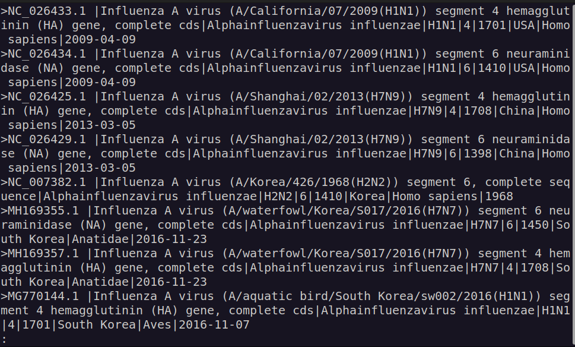

</details>
<br/>

---
## Get sequences only for those where both the Hemagglutinin (HA) and Neuraminidase (NA) gene sequences are available
```bash
grep "^>" sequences_IA_HA_NA.fasta | grep -v "KC95119[68]" | sed 's/.\+virus (//' | sed 's/)) [a-z]\+ .\+/)/' | uniq -c | grep -P "^\s+2" | sed 's/^\s\+2 //' > HA_NA_genes.lst;
```

- Command breakdown

```bash
grep "^>" sequences_IA_HA_NA.fasta \ # grab only the header (lines starting with ">").
| grep -v "KC95119[68]" \            # remove accessions KC951196 and KC951198
| sed 's/.\+virus (//' \             # remove all text preceding the virus name*.
| sed 's/)) [a-z]\+ .\+/)/' \        # remove all text following the virus name*.
| uniq -c \                          # get a unique list of the identifiers and count the number of occurrences
| grep -P "^\s+2" \                  # select only those lines where exactly two sequences are found per unique identifier
| sed 's/^\s\+2 //' \                # remove the count preceding the identifier
> HA_NA_genes.lst;                   # output result to file containing the list
```

<details>

<summary>* internationally accepted naming convention for influenza viruses</summary>

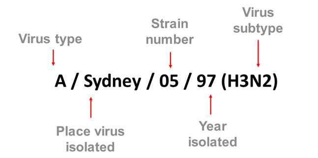

Source: Modified from http://www.ncbi.nlm.nih.gov/pmc/articles/PMC2395936/pdf/bullwho00427-0070.pdf

</details>

<details>

<summary>See output</summary>

```bash
grep "^>" sequences_IA_HA_NA.fasta | grep -v "KC95119[68]" | less;
```


```bash
grep "^>" sequences_IA_HA_NA.fasta | grep -v "KC95119[68]" | sed 's/.\+virus (//' | less;
```

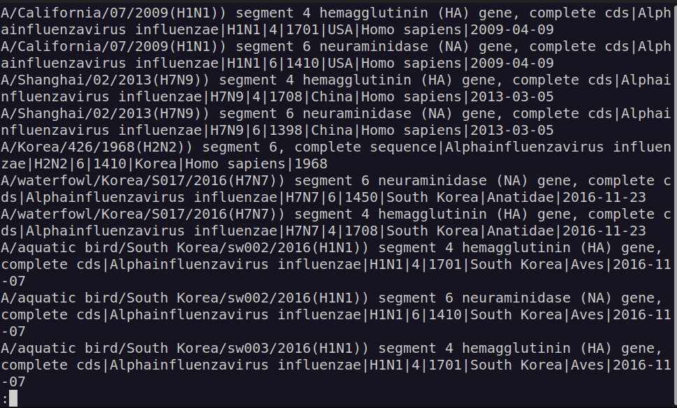

```bash
grep "^>" sequences_IA_HA_NA.fasta | grep -v "KC95119[68]" | sed 's/.\+virus (//'  | sed 's/)) [a-z]\+ .\+/)/' | less;
```

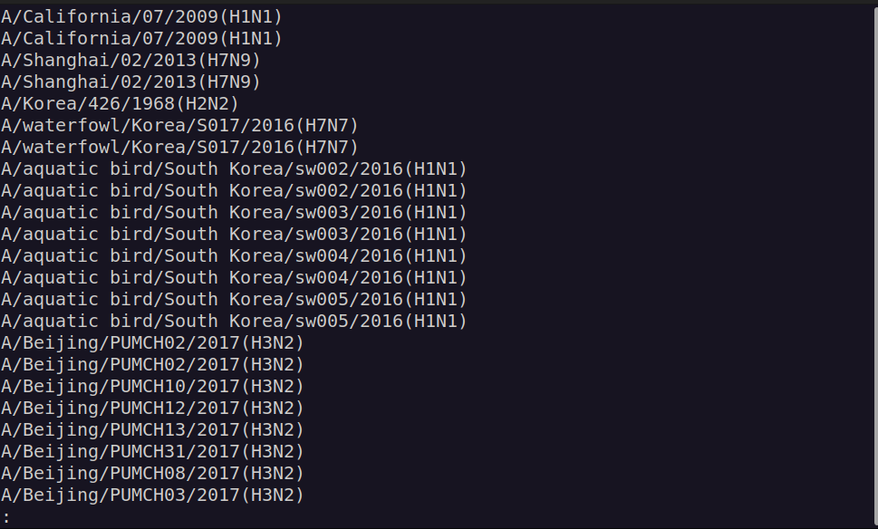

```bash
grep "^>" sequences_IA_HA_NA.fasta | grep -v "KC95119[68]" | sed 's/.\+virus (//'  | sed 's/)) [a-z]\+ .\+/)/' | uniq -c | less;
```

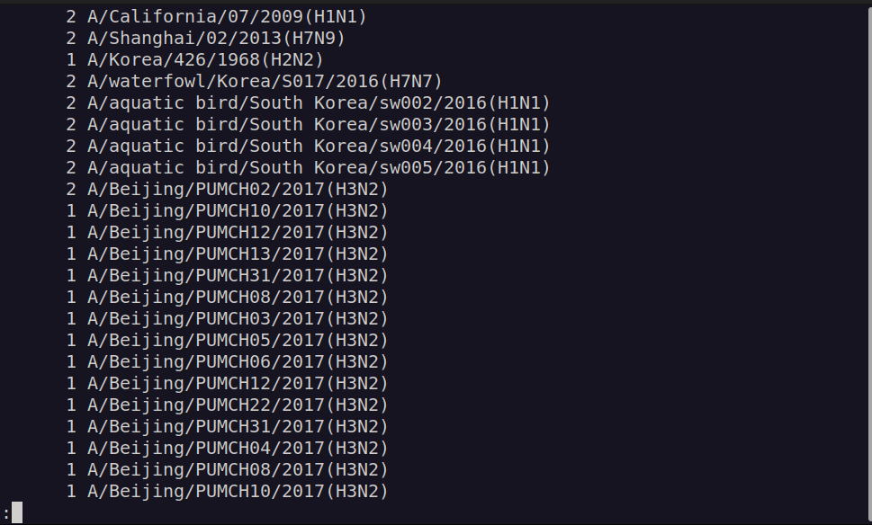

```bash
grep "^>" sequences_IA_HA_NA.fasta | grep -v "KC95119[68]" | sed 's/.\+virus (//'  | sed 's/)) [a-z]\+ .\+/)/' | uniq -c | grep -P "^\s+2" | less;
```

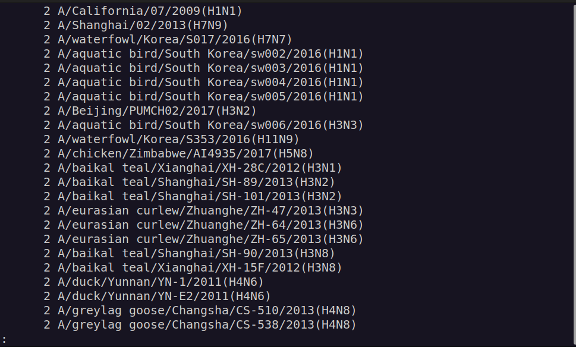

```bash
grep "^>" sequences_IA_HA_NA.fasta | grep -v "KC95119[68]" | sed 's/.\+virus (//'  | sed 's/)) [a-z]\+ .\+/)/' | uniq -c | grep -P "^\s+2" | sed 's/^\s\+2 //' | less;
```

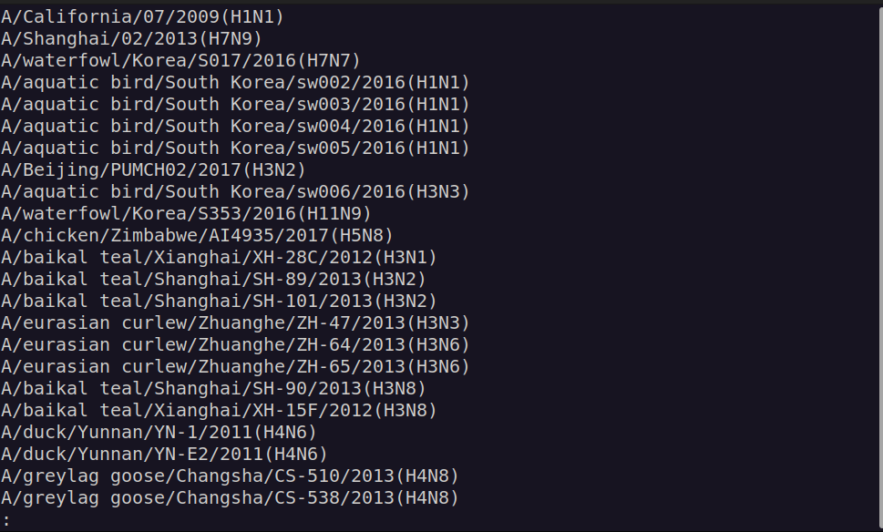

</details>
<br/>

---
### Let's count how many unique identifiers (i.e. unique viruses) occurr **only** twice
```bash
wc -l HA_NA_genes.lst;
```
<br/>

---
### Now, let's filter out those unique viruses for which either HA or NA genes are missing 
```bash
perl filter_and_separate.pl HA_NA_genes.lst sequences_IA_HA_NA.fasta;
```
See [filter_and_separate.pl](./scripts/filter_and_separate.pl)

We get two files created
   - HA_genes.ffn
   - NA_genes.ffn

Important: From now one we are working on two file streams: the hemagglutinin ("HA") and the Neuraminidase ("NA").

<br/>

---
## Simplify and standardise headers
```bash
sed 's/>\(\S\+\) \S\+ .\+|\(H[0-9]\+N[0-9]\+\)|[^|]\+|[0-9]\+|\(\S\+\)/>\1|\2|\3/' HA_genes.ffn | sed 's/\s\+/_/g' > HA_genes_newHead.ffn;
sed 's/>\(\S\+\) \S\+ .\+|\(H[0-9]\+N[0-9]\+\)|[^|]\+|[0-9]\+|\(\S\+\)/>\1|\2|\3/' NA_genes.ffn | sed 's/\s\+/_/g' > NA_genes_newHead.ffn;
```

- Command breakdown

Given the following example header

`>NC_026433.1 |Influenza A virus (A/California/07/2009(H1N1)) segment 4 hemagglutinin (HA) gene, complete cds|Alphainfluenzavirus influenzae|H1N1|4|1701|USA|Homo sapiens|2009-04-09`

```regex
>\(\S\+\)
```
> `NC_026433.1`. `\(text\)` saves to `\1`, `\2`, `\3`, ...

```regex
 \S\+ .\+|
```
> ` |Influenza A virus (A/California/07/2009(H1N1)) segment 4 hemagglutinin (HA) gene, complete cds|Alphainfluenzavirus influenzae|`

```regex
\(H[0-9]\+N[0-9]\+\)
```
> `H1N1`. Saved to `\2`

```regex
|[^|]\+|[0-9]\+|'
```
> `|4|1701|`

```regex
\(\S\+\)'
```
> `USA|Homo sapiens|2009-04-09`. Saved to `\3`

```regex
>\1|\2|\3/
```
> Substitute whole header string with `>NC_026433.1|H1N1|USA|Homo sapiens|2009-04-09`.
> - `\1`: "NC_026433.1".
> - `\2`: "H1N1".
> - `\3`: "USA|Homo_sapiens|2009-04-09".

```bash
sed 's/\s\+/_/g'
```
> Substitute all continuous white spaces with a single `_`.
</br>

Now, lets see our brand new file.
```bash
less HA_genes_newHead.ffn;
```

<details>

<summary>See output</summary>

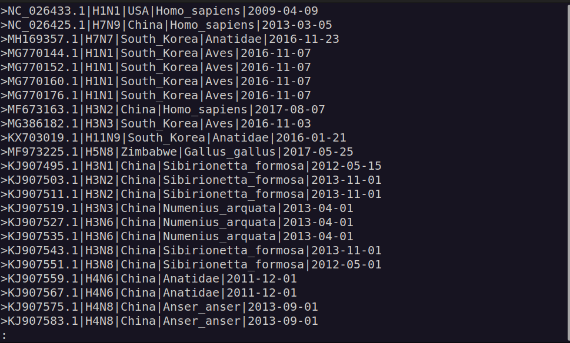

</details>
<br/>

---
### Wait! Let's do some checks

While `|` separates the different fields from the header, what happens if data is missing from one field?

Lets check for missing (i.e. empty) fields

```bash
grep '||' HA_genes_newHead.ffn;
```

<details>

<summary>See output</summary>

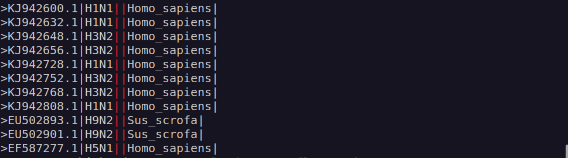

</details>

In order to fix this, we will add to the previous commands a replacement for missing fields.
```bash
sed 's/||/|nonRec|/g'   # Substitute missing field within the string
sed 's/|$/|nonRec/'     # Substitute missing field at the end of the string
```
> This will substitute missing fields for a standardised string `nonRec`.

Generate FASTA files with correct simplified headers
```bash
sed 's/>\(\S\+\) \S\+ .\+|\(H[0-9]\+N[0-9]\+\)|[^|]\+|[0-9]\+|\(\S\+\)/>\1|\2|\3/' HA_genes.ffn | sed 's/\s\+/_/g' | sed 's/||/|nonRec|/g' | sed 's/|$/|nonRec/' > HA_genes_newHead.ffn;
sed 's/>\(\S\+\) \S\+ .\+|\(H[0-9]\+N[0-9]\+\)|[^|]\+|[0-9]\+|\(\S\+\)/>\1|\2|\3/' HA_genes.ffn | sed 's/\s\+/_/g' | sed 's/||/|nonRec|/g' | sed 's/|$/|nonRec/' > NA_genes_newHead.ffn;
```
<br/>

---
## Tranlsate nucleotide sequences to amino acids for alignment
```bash
seqkit translate --frame 1 --transl-table 1 --seq-type dna --threads 2 HA_genes_newHead.ffn | less;
```

- Command breakdown

```bash
seqkit translate \    # use the "translate" tool from seqkit
--frame 1 \           # translate only frame 1
--transl-table 1 \    # use translation table 1
--seq-type dna \      # input sequence is DNA
--threads 2 \         # use two threads for processing
HA_genes_newHead.ffn; # specify input file
```

<details>

<summary>See output</summary>

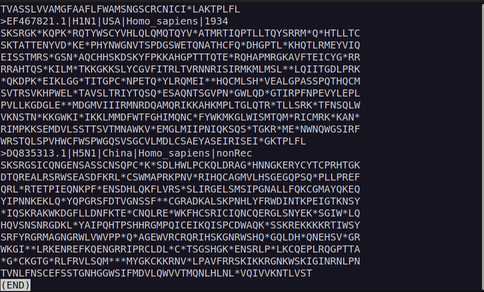

**WARNING!** Sequences are not all in the correct start frame.

</details>

### Identify correct starting frame and trim resulting files
Make a tabular file with percentage of asterisks in the third colum.
```bash
seqkit  translate --frame 1,2,3 --transl-table 1 --seq-type dna --threads 2 HA_genes_newHead.ffn | seqkit fx2tab -B '*' > tmp_HA_genes_newHead_trans3.tab;
seqkit  translate --frame 1,2,3 --transl-table 1 --seq-type dna --threads 2 NA_genes_newHead.ffn | seqkit fx2tab -B '*' > tmp_NA_genes_newHead_trans3.tab;
```

- Command breakdown

```bash
seqkit translate \     # use the "translate" tool from seqkit
--frame 1,2,3 \        # translate on all forward sense frames (1,2,3)
--transl-table 1 \     # use translation table 1
--seq-type dna \       # input sequence is DNA
--threads 2 \          # use two threads for processing
HA_genes_newHead.ffn \ # specify input file
| seqkit fx2tab \      # pass result to "fx2tab" seqkit tool
-B '*';                # get percentage of chosen character ("*") per tranlsated sequence
```

<details>

<summary>See output</summary>

```bash
less tmp_HA_genes_newHead_trans3.tab;
```

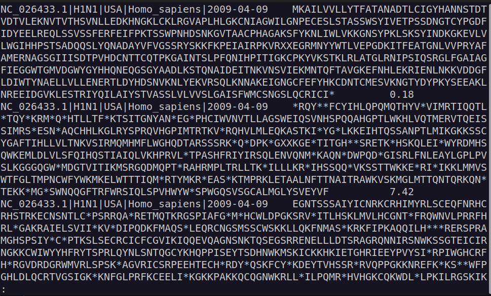

</details>

Get a tabular file with the corresponding predicted correct frame
```bash
perl predict_frame.pl tmp_HA_genes_newHead_trans3.tab > tmp_HA_genes_newHead_frame.tab;
perl predict_frame.pl tmp_NA_genes_newHead_trans3.tab > tmp_NA_genes_newHead_frame.tab;
```

<details>

<summary>See output</summary>

```bash
less tmp_HA_genes_newHead_frame.tab;
```

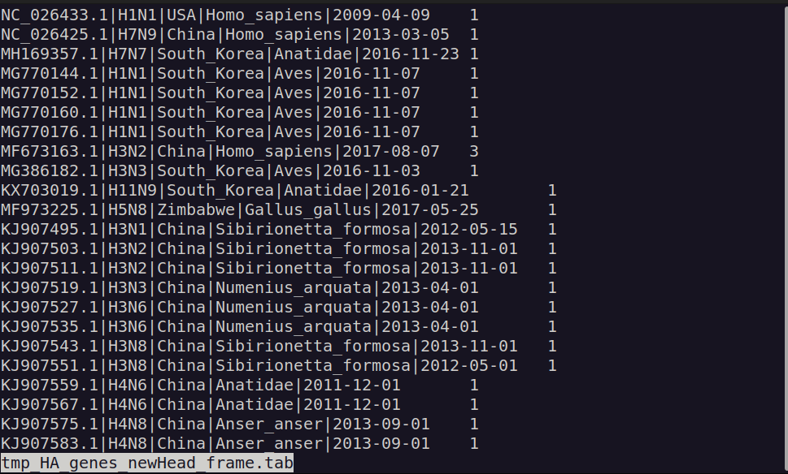

</details>

Make new ffn files with correct frame by trimming
```bash
perl trim_fasta_to_frame.pl tmp_HA_genes_newHead_frame.tab HA_genes_newHead.ffn | awk '/^>/ {if (NR > 1) printf("\n"); printf("%s\n", $0); next;} {printf("%s", $0);} END {printf("\n");}' > HA_genes_newHead_corrFrame.ffn;
perl trim_fasta_to_frame.pl tmp_NA_genes_newHead_frame.tab NA_genes_newHead.ffn | awk '/^>/ {if (NR > 1) printf("\n"); printf("%s\n", $0); next;} {printf("%s", $0);} END {printf("\n");}' > NA_genes_newHead_corrFrame.ffn;
```

- Command breakdown

```bash
awk '/^>/ {if (NR > 1) printf("\n"); printf("%s\n", $0); next;} {printf("%s", $0);} END {printf("\n");}';
```
This is a complex one-liner script in awk. It is intended to transform a so-called "multi-line" FASTA into a "one-line" FASTA, where all the sequence is contiguous in one single line. This facilitates downtream operations on the sequence.

Use seqkit to translate the files
```bash
seqkit translate --frame 1 --transl-table 1 --seq-type dna --threads 2 HA_genes_newHead_corrFrame.ffn > HA_genes_newHead_corrFrame.faa;
seqkit translate --frame 1 --transl-table 1 --seq-type dna --threads 2 NA_genes_newHead_corrFrame.ffn > NA_genes_newHead_corrFrame.faa;
```

<details>

<summary>See output</summary>

```bash
less HA_genes_newHead_corrFrame.faa;
```

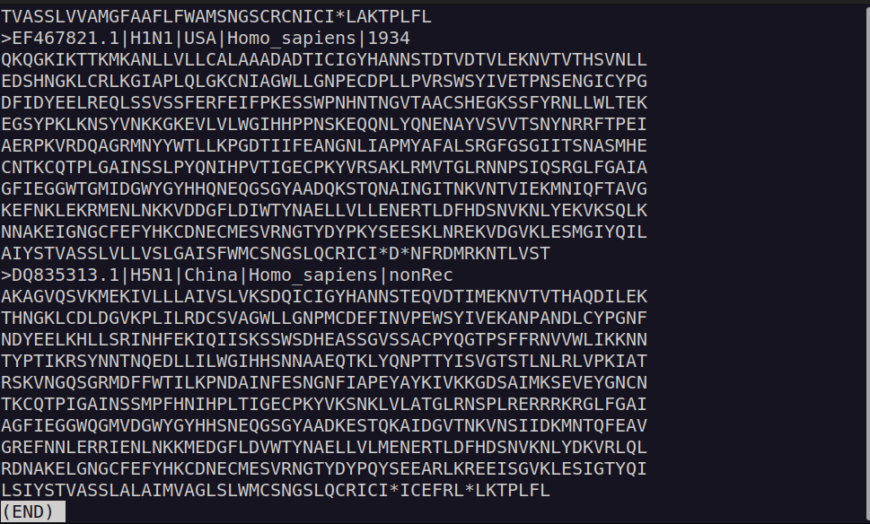

**Warning!** Some genes still have additional residues after the stop codon! XXX changeimage

</details>

Use seqkit to translate the files and then trim the stop codons and subsequent aminoacids
```bash
seqkit translate --frame 1 --transl-table 1 --seq-type dna --threads 2 HA_genes_newHead_corrFrame.ffn | awk '/^>/ {if (NR > 1) printf("\n"); printf("%s\n", $0); next;} {printf("%s", $0);} END {printf("\n");}' | sed 's/\*\S*//' > HA_genes_newHead_corrFrame.faa;
seqkit translate --frame 1 --transl-table 1 --seq-type dna --threads 2 NA_genes_newHead_corrFrame.ffn | awk '/^>/ {if (NR > 1) printf("\n"); printf("%s\n", $0); next;} {printf("%s", $0);} END {printf("\n");}' | sed 's/\*\S*//' > NA_genes_newHead_corrFrame.faa;
```

- Command breakdown

```bash
sed 's/\*\S*//'; # Substitute an asterisk and all following characters by nothing (essentially deleting them)
```
</br>

### Make metadata files from the headers for use with iTOL
```bash
printf "accession\tsubtype\tcountry\thost\tdate\n" > genes_metadata_HA.tab;
printf "accession\tsubtype\tcountry\thost\tdate\n" > genes_metadata_NA.tab;
grep ">" HA_genes_newHead_corrFrame.faa | sed 's/>//' | sed 's/|/\t/g' >> genes_metadata_HA.tab;
grep ">" NA_genes_newHead_corrFrame.faa | sed 's/>//' | sed 's/|/\t/g' >> genes_metadata_NA.tab;
```
