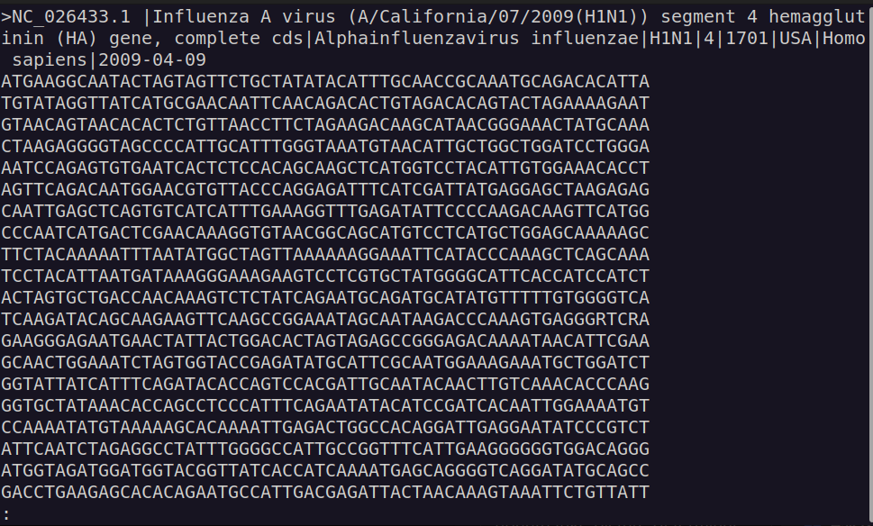

# Block 2: Processing of sequence dataset
## Visualise file

```bash
less sequences_IA_HA_NA.fasta;
```
Click <kbd>↑</kbd> and <kbd>↓</kbd> to navigate through the file visualisation.

Click <kbd>Q</kbd> to exit the viewing.

<details>

<summary>See output</summary>



</details>


## Count sequences
```bash
grep ">" sequences_IA_HA_NA.fasta;
```


## Look at headers: too long and too much information 🤮
```bash
grep ">" sequences_IA_HA_NA.fasta | less;
```
`| less` is used to pass the output of `grep ">" sequences_IA_HA_NA.fasta`. This allows us to scroll through the ouput in a similar fashion as before.


## Get sequences only for those whereboth the Hemagglutinin (HA) and Neuraminidase (NA) gene sequences are available
```bash
grep "^>" sequences_IA_HA_NA.fasta | grep -v "KC95119[68]" | sed 's/.\+virus (//' | sed 's/)) [a-z]\+ .\+/)/' | uniq -c | grep -P "^\s+2" | sed 's/^\s\+2 //' > HA_NA_genes.lst;
```

`grep "^>" sequences_IA_HA_NA.fasta`: grab only the header (lines starting with ">").

`| grep -v "KC95119[68]"`: 

```bash
grep "^>" sequences_IA_HA_NA.fasta \ # grab only the header (lines starting with ">").
| grep -v "KC95119[68]" \            # remove accessions KC951196 and KC951198
| sed 's/.\+virus (//' \             # remove all text preceding the internationally accepted naming convention for influenza viruses*.
| sed 's/)) [a-z]\+ .\+/)/' \        # remove all text following internationally accepted naming convention for influenza viruses.
| uniq -c \                          # get a unique list of the identifiers and count the number of occurrences
| grep -P "^\s+2" \                  # select only those lines where exactly two sequences are found per unique identifier
| sed 's/^\s\+2 //' \                # remove the count preceding the identifier
> HA_NA_genes.lst;                   # output result to file containing the list
```

\* [internationally accepted naming convention for influenza viruses](./images/influenza_naming_diagram_CDC.jpg). from http://www.ncbi.nlm.nih.gov/pmc/articles/PMC2395936/pdf/bullwho00427-0070.pdf.

Now, let's count how many unique identifiers occurring **only** twice we end up with.
```bash
wc -l HA_NA_genes.lst;
```
