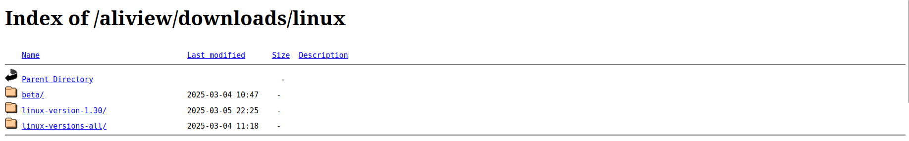
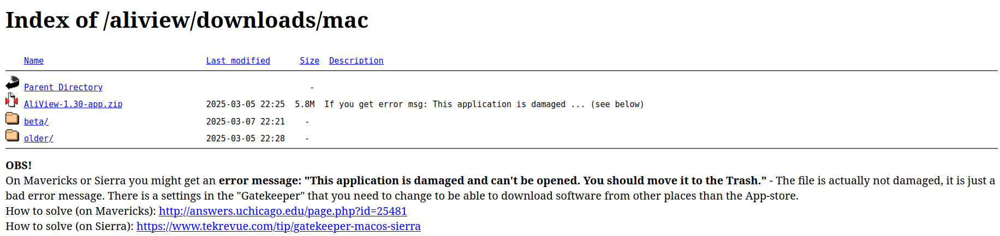
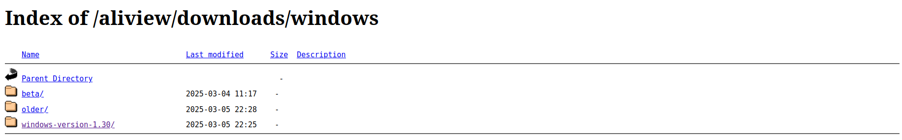

# Block 2

## Alignment

The plan is to align the translated amino acid sequences of the HA and NA proteins, then align them, then back-translate them to nucleotide sequences and then finally align these nucleotide sequences.

Why the back-and-forth translating step?
<details>
  <summary>
    Solution
  </summary>
There are 2 main reasons for this:
  
a) AA sequences are more conserved. Due to the degeneracy of the genetic code (multiple codons can code for the same amino acid), the nucleotide sequence of a gene evolves much faster than its corresponding amino acid sequence. The third position in a codon (the "wobble base") can often change without affecting the protein at all. Therefore, IN SOME CASES, aligning the nucleotide sequence can give a more detailed picture of the true evolutionary history. However...

b) Since the fundamental unit of a protein is the **codon** (a triplet of nucleotides), keeping the frame is essential for aligning. Hence, if we would align 2 nucleotide sequences right away, the aligner might introduce gaps and therefore shift one of the sequences, completely removing the codon information.

By going back and forth like the way we do this, we avoid b) while having the nice advantages of a).
  
</details>

For these steps, we move to `tree/`:

`$ cd ../tree`

**Step 1: AA Alignment**

We will align the sequences with `mafft` (https://mafft.cbrc.jp/alignment/server/index.html). Its a solid and widely used aligner, which can handle our ~800 sequences. Still, this step will take a couple of minutes!

```bash
mafft --thread 4 --amino --localpair --maxiterate 1000 ../processed_HA_NA/HA_genes_newHead_corrFrame.faa > HA_genes_newHead_corrFrame_aln.faa;
mafft --thread 4 --amino --localpair --maxiterate 1000 ../processed_HA_NA/NA_genes_newHead_corrFrame.faa > NA_genes_newHead_corrFrame_aln.faa;
```


**Step 2: Back-translation**

We use pal2nal.pl (https://www.bork.embl.de/pal2nal/) to backtranslate. 

```
perl ../scripts/pal2nal.pl HA_genes_newHead_corrFrame_aln.faa ../tmp/HA_genes_newHead_corrFrame.ffn -output fasta -codontable 1 > HA_genes_newHead_corrFrame_aln.ffn

erl ../scripts/pal2nal.pl NA_genes_newHead_corrFrame_aln.faa ../tmp/NA_genes_newHead_corrFrame.ffn -output fasta -codontable 1 > NA_genes_newHead_corrFrame_aln.ffn

```


**Step 3: View alignment**

Lets first view our alignment using [Aliview](https://github.com/AliView/AliView), a lightweight alingment viewer/editor.

Here are the links to download it for three different operating systems.

- Windows - http://www.ormbunkar.se/aliview/downloads/linux



- OsX - http://www.ormbunkar.se/aliview/downloads/mac



- Linux - http://www.ormbunkar.se/aliview/downloads/windows




**Step 4: Trim alignment**

As you've seen, we got some overhangs in our alignment, which creates unnecessary noise in our alignment and therefore tree. Note that this step needs careful consideration, in some cases keeping overhangs is fine and actually the _correct_ way. 

For now, lets trim. We are going to use `trimal` for that. 

```
trimal -in NA_genes_newHead_corrFrame_aln.ffn -out NA_genes_newHead_corrFrame_aln_trimmed.ffn -automated1
trimal -in HA_genes_newHead_corrFrame_aln.ffn -out HA_genes_newHead_corrFrame_aln_trimmed.ffn -automated1
```


